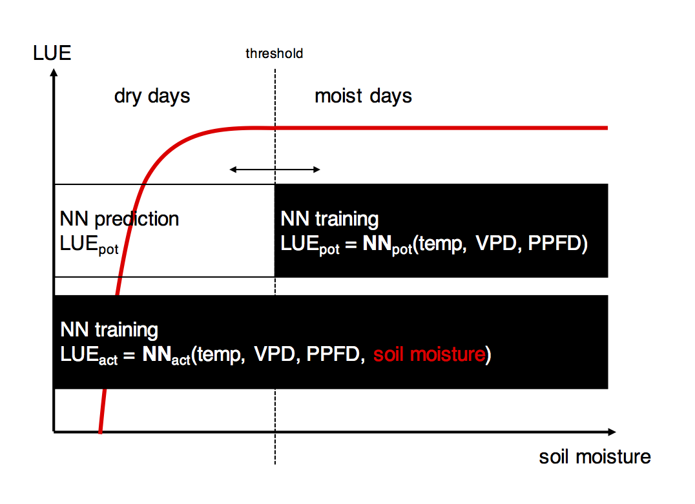

This R-Markdown document provides step-by-step instructions for executing the analysis and producing figures presented in XXX. The starting point of the present collection of scripts is the data file `./data/modobs_fluxnet2015_s11_s12_s13_with_SWC_v3.Rdata` which contains all the data used for the NN training and analysis. Further information about data processing and creating the data file is given below (section Data preparation). Using R-Markdown here is supposed to allow for  reproducibility of published results - from original data files to published figures. 

This data file, as well as all scripts executed here, are is provided through under a XXX license, written by Benjamin Stocker, and distributed through github XXX. 

## Approach

We quantify the fractional reduction in light use efficiency due to soil moisture, separated from VPD and greenness effects as the ratio of actual versus potential LUE:
$$
\mathrm{fLUE} = \mathrm{LUE}_{\mathrm{act}}\; /\; \mathrm{LUE}_{\mathrm{pot}}
$$
"Potential"" light use efficiency (LUE$_{\mathrm{pot}}$) is predicted using artificial neural networks (NN, see below), trained on the empirical relationship between observed LUE (LUE$_{\mathrm{obs}}$) and its predictors temperature, VPD, and PPFD during days where soil moisture is not limiting ("moist days"). All NN training is done for each site specifically. "Actual" LUE (LUE$_{\mathrm{act}}$) is derived from NNs using all data and, in contrast to the NN for LUE$_{\mathrm{pot}}$, with soil moisture as an additional predictor (see Fig. S1). 

{ width=50% }

LUE$_{\mathrm{obs}}$ is calculated based on daily total observed GPP (GPP$_{\mathrm{obs}}$), PPFD, and fAPAR, measured at each site. We refer to the alternative NN models used for predicting LUE$_{\mathrm{act}}$ and LUE$_{\mathrm{pot}}$ as NN$_{\mathrm{act}}$ and NN$_{\mathrm{pot}}$, respectively.
$$ 
\mathrm{LUE}_{\mathrm{obs}} = \frac{\mathrm{GPP}_{\mathrm{FLX}} }{ \mathrm{fAPAR}_{\mathrm{EVI}} \cdot \mathrm{PPFD}_{\mathrm{FLX}} } \simeq \begin{cases}
\mathrm{NN}_{\mathrm{pot}}( T_{\mathrm{FLX}}, \mathrm{VPD}_{\mathrm{FLX}}, \mathrm{PPFD}_{\mathrm{FLX}} ), & ( T_{\mathrm{FLX}}, \mathrm{VPD}_{\mathrm{FLX}}, \mathrm{PPFD}_{\mathrm{FLX}} ) \in \mathrm{moist\ days}  \\
\mathrm{NN}_{\mathrm{act}}( T_{\mathrm{FLX}}, \mathrm{VPD}_{\mathrm{FLX}}, \mathrm{PPFD}_{\mathrm{FLX}}, \theta ), &  ( T_{\mathrm{FLX}}, \mathrm{VPD}_{\mathrm{FLX}}, \mathrm{PPFD}_{\mathrm{FLX}} ) \in \mathrm{all\ days}
\end{cases}
$$
LUE$_{\mathrm{obs}}$ is used as the target variable for NN$_{\mathrm{act}}$ and NN$_{\mathrm{pot}}$. Predictor (input) variables are temperature ($T$), vapour pressure deficit (VPD), and the photon flux density (PPFD). Their subscripts refer to the data source with $\mathrm{FLX}$ referring to the FLUXNET 2015 dataset and $\mathrm{EVI}$ to MODIS EVI. Further information about data sources and processing is given below (section Data processing).

We limit the NN training to a small number of predictors that are reflective of process understanding regarding the controls on LUE (Prentice et al., 2014) and to avoid over-fitting. The agreement between potential and actual LUE, using the two NN models' prediction, should be good during "moist days" (high soil moisture). In contrast, the potential LUE from the "moist days" NN model is expected to overestimate LUE during days of low soil moisture (see Fig. S2 and S3). With the only difference between NN models being soil moisture as an additional predictor, the ratio fLUE thus indicates the separated effect of soil moisture on LUE. fLUE droughts are identified when fLUE falls below a site-specific threshold.

## Neural network training
### Functions used
Neural networks (1 hidden layer) are trained (R packages `nnet` and `caret`) using repeated (5 times) five-fold crossvalidation where 75% of data for training in each iteration. The learning rate decay rate is set to 0.1 and the number nodes in the hidden layer is sampled from 4 to 20 (step 2). The best-performing NN (RMSE) is selected, the same procedure is repeated five times, and the mean across repetitions is used for further analyses.

The following code snippets are used by function `profile_soilm_neuralnet()` and functions called therein (see below for a full description of the sequence of commands executed to produce results).

1. Data is scaled to within zero and one.
```{r eval=FALSE}
preprocessParams <- preProcess( data, method=c("range") )
```
2. Do a 5-fold (argument `number=5`) cross-validation, repeated 5 times (argument `repeats=5`), for the NN training and selecting optimal number of nodes in the NN-model (only one hidden layer in the NN). In each iteration, 75% of the data is used for training and 25% for testing (argument `p=0.75`).
```{r eval=FALSE}
traincotrlParams <- trainControl( method="repeatedcv", number=5, repeats=5, verboseIter=FALSE, p=0.75 )
```
3. Train the NN. The decay of the learning rate parameter is set to 0.1 (This generally yields best results according to additional tests). The number of nodes is sampled from four to twenty in steps of two.
```{r eval=FALSE}
tune_grid <- expand.grid( .decay = c(0.1), .size = seq(4,20,2) )
nn <- train(
            lue_obs_evi ~ ppdf + temp + vpd,
            data      = data,
            method    = "nnet",
            linout    = TRUE,
            tuneGrid  = tune_grid,
            preProc   = preprocessParams,
            trControl = traincotrlParams,
            trace     = FALSE
            )

```
This procedure is repeated five times and the mean across individual NN predictions is used for further analysis.

### Data splitting into moist and dry days
The threshold for splitting training data into "moist" and "dry" days, where "moist" days' data is used to train NNpot and all data is used to train NNact (see Fig. S1), is determined by optimal performance in the face of the trade-off between the number of data points and including data where low soil moisture affects fluxes. The algorithm can be described as follows:

1. Select the five best soil moisture thresholds, for which the difference in the median of the overpredictions of the "good days" model during bad days is highest.
2. Among the five best thresholds selected by step 1, chose the threshold for which the variance of fLUE during "good days" is minimal.

This is done for each soil moisture dataset separately. This is implemented by function `profile_soilm_neuralnet()` (see Section 'Profiling soil moisture threshold').


## Process sequence
The following provides a documentation and instruction to reproduce results presented in the paper. The starting point is the Rdata file `modobs_fluxnet2015_s11_s12_s13_with_SWC_v3.Rdata` where original data downloaded from different sources is stored in a standardised way. We limit the documentation to NN training, fLUE calculation and drought event detection and quality checking. Remaining steps to produce all figures can be XXX.

### 1. Requirements and environment setup
The execution of the scripts provided here requires the following R packages. Install them if missing (Sorry if some are missing - It's hard to keep the overview):
```{r}
list.of.packages <- c( "dplyr", "tidyr", "broom", "caret", "nnet", "minpack.lm", "LSD", "zoo", "Metrics", "abind", "caTools", "cgwtools", "hydroGOF", "cluster", "ggplot2", "stats", "knitr" )
new.packages <- list.of.packages[!(list.of.packages %in% installed.packages()[,"Package"])]
if( length(new.packages) ) install.packages(new.packages)
```

Create sub-directories:
```{r echo=FALSE}
if (!file.exists("./data")) system( "mkdir ./data" )
if (!file.exists("fig_nn_fluxnet2015/modobs_alldays/profile/")) system("mkdir -p fig_nn_fluxnet2015/modobs_alldays/profile")
if (!file.exists("fig_nn_fluxnet2015/modobs_gooddays/profile/")) system("mkdir -p fig_nn_fluxnet2015/modobs_gooddays/profile")
if (!file.exists("fig_nn_fluxnet2015/ratio_vs_threshold")) system("mkdir -p fig_nn_fluxnet2015/ratio_vs_threshold")
if (!file.exists("fig_nn_fluxnet2015/plot_rsq_vs_smtrh")) system("mkdir -p fig_nn_fluxnet2015/plot_rsq_vs_smtrh")
if (!file.exists("fig/soilm")) system("mkdir -p fig/soilm")
if (!file.exists("fig_nn_fluxnet2015/fvar_vs_soilm")) system( "mkdir -p fig_nn_fluxnet2015/fvar_vs_soilm" )
if (!file.exists("fig_nn_fluxnet2015/panel_potentialgpp")) system( "mkdir fig_nn_fluxnet2015/panel_potentialgpp" )
if (!file.exists("fig_nn_fluxnet2015/aligned_binned")) system("mkdir fig_nn_fluxnet2015/aligned_binned")
if (!file.exists("fig_nn_fluxnet2015/modobs")) system("mkdir fig_nn_fluxnet2015/modobs")
if (!file.exists("fig_nn_fluxnet2015/bias_vs_fvar")) system("mkdir fig_nn_fluxnet2015/bias_vs_fvar")
if (!file.exists("fig_nn_fluxnet2015/cci_vs_gpp")) system("mkdir fig_nn_fluxnet2015/cci_vs_gpp")
if (!file.exists("fig_nn_fluxnet2015/cci_vs_fvar")) system("mkdir fig_nn_fluxnet2015/cci_vs_fvar")
if (!file.exists("fig_nn_fluxnet2015/aligned")) system("mkdir fig_nn_fluxnet2015/aligned")
if (!file.exists("fig_nn_fluxnet2015/aligned_cluster")) system("mkdir fig_nn_fluxnet2015/aligned_cluster")
if (!file.exists("fig_nn_fluxnet2015/pot_vs_act_NN/")) system("mkdir fig_nn_fluxnet2015/pot_vs_act_NN/")
if (!file.exists("fig_nn_fluxnet2015/hist")) system("mkdir fig_nn_fluxnet2015/hist")
if (!file.exists("./data/profile")) system("mkdir ./data/profile")
```

Define path variable used throughout all scripts and functions. `myhome` is used only by functions where argument `testprofile` is `FALSE`, i.e. when evaluating all analyses for all sites (batch execution). Example profiling and NN evaluation for one site done here (in this RMarkdown document) writes and reads data into `./data/`:
```{r}
workingdir <- getwd()
print( paste("working directory directory:", workingdir ) )
myhome <- "/alphadata01/bstocker/"
```

### 2. Data processing
The scripts used to process downloaded data are not provided here but steps are described below. Instead, the data file `./data/modobs_fluxnet2015_s11_s12_s13_with_SWC_v3.Rdata` contains for each site all the processed data used for the NN training and all subsequent analyses. 

Get this file and store it in `./data` by
```{r}
if (!file.exists("./data/modobs_fluxnet2015_s11_s12_s13_with_SWC_v3.Rdata")) system( "wget http://bstocker.net/downloads/modobs_fluxnet2015_s11_s12_s13_with_SWC_v3.Rdata ./data/" )
```

Load the data file.
```{r}
load( "./data/modobs_fluxnet2015_s11_s12_s13_with_SWC_v3.Rdata" )
```
The data is organised as a nested list of dataframes. Inside fluxnet$<sitename>, there is a list for daily (`ddf`), monthly (`mdf`), and annual data (`adf`):
```{r}
str(fluxnet$`AR-SLu`, max.level = 1)
```
Daily data (`ddf`) is used here.
```{r}
str(fluxnet$`AR-SLu`, max.level = 1)
```

- `s11`: contains P-model and SPLASH outputs of simulation s11 (water holding capacity is 220 mm).
- `s12`: contains P-model and SWBM outputs of simulation s12.
- `s13`: contains P-model and SWBM outputs of simulation s13 (water holding capacity is 150 mm).
- `obs`: contains GPP and ET data from FLUXNET 2015 dataset.
- `inp`: climate and greenness (input) data from the FLUXNET 2015 dataset and MODIS EVI and FPAR.
- `swc_obs`: observational soil moisture data from the FLUXNET 2015 dataset.
- `swc_by_etobs`: soil moisture data driven by observational ET.


#### Soil moisture
Soil moisture data is based direct measurements, provided through the FLUXNET 2015 dataset, and five alternative bucket-type models. Measured soil moisture is provided in units of volume water per volume soil. We scaled data by range to within 0 and 1. Due to limited observational soil moisture data availability and mostly unavailable soil moisture data for deep soil layers, we also used simulated soil moisture, provided by alternative, bucket-type soil water balance models.


- **SPLASH** (Davis et al., 2017) is based on a Priestley-Taylor formulation for simulating evapotranspiration. Two alternative water holding capacities ("bucket depth") are used, 150 mm (as in Davis et al., 2017) and 220 mm (as for the SWBM model, see Orth et al. 2013). In the datasets used here, these are referred to as `soilm_splash150`, and `soilm_splash220`.
- **SWBM** (Orth et al., 2013) uses measured net radiation from local measurements (FLUXNET 2015 data) and generates runoff already before the bucket water holding capacity (220 mm) is reached (see Eq. 3 in Orth et al., 2013, $\alpha$=6.4 used here). Similarly, an empirical function down-scales the fraction of evapotranspiration to net radiation as a function of soil water content (Eq. 2 in Orth et al., 2013, $\gamma$=0.06 used here). In the datasets used here, this is termed `soilm_swbm`.
- **ET-driven bucket**. The soil water balance is simulated using precipitation and latent heat flux, measured at the FLUXNET sites. The latent heat flux is converted to mass H$_2$O using a constant conversion factor of $2.26476 \times 10^6 \mathrm{\ J\ mm}^{-1}$. Latent heat flux data from FLUXNET 2015 (variable `LE_F_MDS`) is cleaned first if more than 80% of the underlying half-hourly data is gap-filled, then gap-filled using neural networks (temperature, PPFD, VPD, and ET simulated by the SPLASH model as predictors, using R package `nnet` and `caret`, single hidden layer, 20 nodes, 10-fold cross-validated). The water-holding capacity of the ET-driven buckets is set to 220 mm. Two bucket versions are used. One where no runoff is generated before the soil water holding capacity is reached (`soilm_etobs`), and one where runoff is generated before as in the SWBM model (see above, termed `soilm_etobs_ob`).
All models are driven by observed precipitation, measured at the FLUXNET sites.

The following creates a plot showing alternative soil moisture time series (observations and models) for one site ('US-Var').
```{r message=FALSE, warning=FALSE}
source("plot_soilm_fluxnet.R")
plot_soilm_fluxnet( "US-Var", fluxnet[[ "US-Var" ]]$ddf, makepdf=FALSE )
```

To produce respective plots as PDFs for all sites, do:
```{r eval=FALSE}
for (sitename in ls(fluxnet)){
  plot_soilm_fluxnet( sitename, fluxnet[[ sitename ]]$ddf, makepdf=TRUE )
}
```

#### GPP
Daily data are used from the FLUXNET 2015 Tier 1 dataset, downloaded on 13. November, 2016. We use GPP based on the Nighttime Partitioning, and the Variable U-Star Threshold method, named `GPP_NT_VUT_REF`. In the FLUXNET 2015 dataset, daily values are sums over half-hourly data. We use only daily values where less than 50% of respective half-hourly data is gap-filled. We further removed data points where the daytime and nighttime methods (`GPP_DT_VUT_REF` and `GPP_NT_VUT_REF`, resp.) are inconsistent. I.e., the upper and lower 2.5% quantile of the difference between each method's GPP quantification. Finally, we removed all negative daily GPP values.

This is implemented by the following function:
```{r eval=FALSE}
clean_fluxnet_gpp <- function( gpp_nt, gpp_dt, qflag_nt, qflag_dt, cutoff=0.80 ){
  ##--------------------------------------------------------------------
  ## Cleans daily data.
  ## gpp_nt: based on nighttime flux decomposition ("NT")
  ## gpp_dt: based on daytime flux decomposition ("DT")
  ##--------------------------------------------------------------------

  ## Remove data points that are based on too much gap-filled data in the underlying half-hourly data
  gpp_nt[ which(qflag_nt < cutoff) ] <- NA  ## based on fraction of data based on gap-filled half-hourly
  gpp_dt[ which(qflag_dt < cutoff) ] <- NA  ## based on fraction of data based on gap-filled half-hourly

  ## Remove data points where the two flux decompositions are inconsistent,
  ## i.e. where the residual of their regression is above the 97.5% or below the 2.5% quantile. 
  res  <- gpp_nt - gpp_dt
  q025 <- quantile( res, probs = 0.025, na.rm=TRUE )
  q975 <- quantile( res, probs = 0.975, na.rm=TRUE )

  gpp_nt[ res > q975 | res < q025  ] <- NA
  gpp_dt[ res > q975 | res < q025  ] <- NA

  ## remove negative GPP
  gpp_nt[ which(gpp_nt<0) ] <- NA
  gpp_dt[ which(gpp_dt<0) ] <- NA

  return( list( gpp_nt=gpp_nt, gpp_dt=gpp_dt ) )
}
```

<!-- Run the following code example (site 'FR-Pue') to read, clean, and convert data from downloaded files. You will have to define the directory where FLUXNET 2015 daily data is located as `dirnam_obs`. -->
<!-- ```{r message=FALSE, warning=FALSE} -->
<!--   source( "get_data_fluxnet2015.R" ) -->
<!--   source( "clean_fluxnet.R" ) -->
<!--   sitename <- "US-Var" -->
<!--   dirnam_obs <- paste( workingdir, "data/FLUXNET-2015_Tier1/20160128/point-scale_none_1d/original/unpacked/", sep="" ) -->
<!--   allfiles <- list.files( dirnam_obs ) -->
<!--   allfiles <- allfiles[ which( grepl( "FULLSET", allfiles ) ) ] -->
<!--   allfiles <- allfiles[ which( grepl( "3.csv", allfiles ) ) ] -->
<!--   filnam_obs <- allfiles[ which( grepl( sitename, allfiles ) ) ] -->
<!--   path <- paste( dirnam_obs, filnam_obs, sep="" ) -->
<!--   out <- get_data_fluxnet2015( path, add_swcvars=TRUE ) -->
<!--   with(out$obs, plot( year_dec, GPP_NT_VUT_REF, main=paste( "GPP for site", sitename), type='l', las=1, ylab = "GPP_NT_VUT_REF (molCO2 m-2 d-1)", xlab = "year" )) -->
<!-- ``` -->

#### Greenness data (fAPAR)
We use MODIS EVI (MOD13Q1, 16 days, 250 m) and MODIS FPAR (MOD15A2, 8 days, 1 km) to quantify fAPAR.  Due to its higher spatial resolution, smaller scatter and smaller tendency to saturate at high values (see Fig. S11), EVI is generally preferred and all results below are based on analyses with EVI data. Results based on FPAR and NDVI data is shown in the SI. Data was downloaded for 81 pixels surrounding the flux tower location (coordinates from FLUXNET 2015) using the `MODISTools` R package. The center pixel's information was used unless quality flags indicated cloudiness or missing data. Data was interpolated to daily values using a Savitzky-Golay smoothing filter (`signal` R package) of order 3 and length 31 days. This generally maintains the full seasonal amplitude but does not fully remove noise. 

*Note to internal: Run the script `get_modobs_fluxnet2015.R` to read and process original files for application in the NN-training. This script creates the file `modobs_fluxnet2015_s11_s12_s13_with_SWC_v3.Rdata`.*


<!-- Relevant metadata for the sites used in this analysis is given in the file './siteinfo_fluxnet2015_sofun.csv'. -->
<!-- ```{r} -->
<!-- siteinfo <- read.csv( "siteinfo_fluxnet2015_sofun.csv" ) -->
<!-- head( siteinfo ) -->
<!-- ``` -->

<!-- This produces PDFs in `./fig/soilm/` of soil moisture vs. time plots as above for each site: -->
<!-- ```{r, message=FALSE, warning=FALSE, eval=FALSE} -->
<!-- for (sitename in ls(fluxnet)){ -->
<!--   plot_soilm_fluxnet( sitename, fluxnet[[ sitename ]]$ddf, makepdf=TRUE ) -->
<!-- } -->
<!-- ``` -->

<!-- ### GPP from P-model, MODIS and MTE -->

### 3. Profiling soil moisture threshold
#### Purpose and outputs
The function `profile_soilm_neuralnet()` samples soil moisture thresholds (0.05-0.60 in steps of 0.05) for separating NN training data into "moist days" (where no soil moisture effect on fluxes is assumed) and "dry days" data. For each threshold and site, steps described in Section 'Neural network training' are executed. The best-performing threshold is selected as described in Section 'Data splitting into moist and dry days'.

The function also derives various performance metrics and creates diagnostic plots that are saved into the following files and directories (where <sitename> is the 6-digit FLUXNET site code, e.g. 'FR-Pue'):

* `./data/profile_lue_obs_nn_<sitename>.Rdata`
* `./fig_nn_fluxnet2015/ratio_vs_threshold/`: Illustrates by how much the "good days model" overestimates LUE during bad days, depending on the chosen soil moisture threshold.
* `plot_rsq_vs_smtrh/plot_rsq_vs_smtrh_lue_obs_evi_<soilmoisturedata>_<sitename>.pdf"`: Plots the R^2 of the good days model's prediction of LUE (during "good days").

All NN predictions and performance metrics are saved in `.Rdata` files:

* `profile_lue_obs_evi_nn_<sitename>.Rdata` : Contains NN predictions for each soil moisture threshold and each of the 5 repetitions, as well as respective performance metrics (RMSE and R^2) for each threshold and information about which threshold performs best (see below: Selection of best-performing soil moisture threshold).
* `profile_light_lue_obs_evi_nn_<sitename>.Rdata` : Contains only summary information (performance metrics and information about best-performing threshold).

<!-- { width=50% } -->

#### Additional data processing and cleaning
Light use efficiency is calculated and outliers (outside 3 times the interquartile range) are removed:
```{r eval=FALSE}
remove_outliers <- function( vec, coef=1.5 ) {
  ## use the command boxplot.stats()$out which use the Tukey's method 
  ## to identify the outliers ranged above and below the <coef`>*IQR.
  outlier <- boxplot.stats( vec, coef=coef )$out
  vec[ which( is.element( vec, outlier ) ) ] <- NA
  return( vec )
}
data <- data %>% mutate( lue_obs_evi  = remove_outliers( gpp_obs / ( ppfd * evi  ), coef=3.0 ) )
```
Soil moisture data is normalised to vary between 0 and 1, where 1 is the maximum value in the time series (generally equal to the maximum water holding cacpacity parameter in the respective model, but for the observational data, we don't know the maximum water holding capacity). This is applied to make values from different models and observations comparable on the same scale. Example for soil moisture model output data `soilm_splash150`:
```{r eval=FALSE}
data <- data %>% mutate( soilm_splash150 = soilm_splash150 / max( soilm_splash150, na.rm=TRUE ) )
```
Tests have shown that relationships between predictors and observed LUE are noisy during winter in temperate and boreal ecosystems. Therefore we limit data used for NN training to days where average temperature is above 5 degrees Celsius. In `profile_soilm_neuralnet.R`, see
```{r eval=FALSE}
df_nona <- dplyr::filter( df_nona, temp > 5.0 )
```
The following just removes NA values from the dataframe used for NN training:
```{r eval=FALSE}
df_nona <- cleandata_nn( df_nona, nam_target )
```

#### Example execution
The code below executes the profiling by soil moisture using MODIS EVI data (argument `nam_target="lue_obs_evi"`). Alternatively, use MODIS FPAR data (`nam_target="lue_obs_fpar"`). If the argument `makepdf=TRUE`, this creates diagnostic plots in subdirectory `./fig_nn_fluxnet2015`, otherwise plots are printed to screen. To speed up things, only one NN is trained only with soil moisture data from one dataset (`varnams_swc=c("soilm_swbm")`), only one repetition for averaging (`nrep=2`), and reduced numbers of soil moisture thresholds sampled (`soilm_threshold=seq( 0.45, 0.55, 0.05 )`). Still, this takes a while - be patient. For the published study, we sampled the a wider range of thresholds (`soilm_threshold = seq( 0.1, 0.60, 0.05 )`) and all available soil moisture datasets (`varnams_swc = c( "soilm_splash150", "soilm_splash220", "soilm_swbm", "soilm_etobs", "soilm_etobs_ob" )`).
```{r message=FALSE, warning=FALSE}
source('profile_soilm_neuralnet.R')
profile_soilm_neuralnet(
  "FR-Pue",
  nam_target="lue_obs_evi",
  soilm_threshold=seq( 0.45, 0.55, 0.05 ), ## reduced range to speed up things
  varnams_swc=c("soilm_swbm"),  ## only SWBM soil moisture to speed up things
  packages="nnet",
  nrep=2,
  makepdf=FALSE,
  use_weights=FALSE,
  overwrite_profile=FALSE,
  testprofile=TRUE
  )
```

The full data from the profiling is now stored in the file `./data/profile/profile_evi_nn_FR-Pue.Rdata`. The best-performing soil moisture threshold (soil water contant as afraction) for dataset `soilm_swbm` is:
```{r message=FALSE}
load("./data/profile/profile_lue_obs_evi_nn_FR-Pue.Rdata")
print( paste( "best-performing soil moisture threshold:", profile_nn$`FR-Pue`$soilm_swbm$nnet$best_soilm_trh ) )
```

#### Complete batch execution
The profiling function described above is executed for 137 sites out of all 166 in the FLUXNET Tier 1 dataset, where modelled soil moisture gave consistent results across different models and was consistent with observed soil moisture where available (observational soil moisture availability is shown above). This step of site exclusion was done by visual judgment based on the comparison of soil moisture time series for each site (Figures created above, see Section '2. Data processing, Soil moisture' and stored in `./fig/soilm/`). The table below shows the judment results (only first 7 rows are shown. Set `n=166` to see the full table).
```{r echo=FALSE, results='asis', warning=FALSE}
library(knitr)
siteinfo <- read.csv( "soilm_data_usability_fluxnet2015.csv", as.is=TRUE )
kable( head( dplyr::select( siteinfo, mysitename, code ), n=7 ), caption = "**Table**: Data usability based on soil moisture, **1** = Observational data available for multiple depths. Use observational data for NN. **2** = Observational data incomplete or inconsistent with ET bucket. ET bucket consistent with SPLASH bucket. Use ET bucket for NN. **3** = Observational data incomplete or inconsistent with ET bucket. ET bucket inconsistent with SPLASH bucket. Use SPLASH or SWBM bucket for NN. **0** = No consistent data.")
```

Due to its high computational demand when evaluating the profiling function for all 137 sites ("batch execution"), it is executed in parallel for each site on a High Performance Computing cluster (Imperial College London, HPC, server *CX1*). Note, that in this case, profile files are written into (and subsequently read from) `{r} paste( myhome, "data/nn_fluxnet/profile/")` (see argument `testprofile` in various functions). 

To do the batch execution, first, create a text file containing the list of sites for which profiling is to be done:
```{r}
do.sites <- dplyr::filter( siteinfo, code!=0 )$mysitename
fileConn <- file("sitelist_doprofile_fluxnet2015.txt")
writeLines( do.sites, fileConn )
close(fileConn)
```
Then, in the terminal, enter
```
./submit_profile_nn_ALL.sh
```
This creates a job submission file for each site from `submit_profile_nn_XXXXX.sh` and submits it to the cluster by `qsub`. Note that the job submission file may have to be adjusted for execution on other clusters.

### 4. Derive fLUE and identify drought periods
#### Purpose and steps
This step is implemented by function `nn_fVAR_fluxnet()`. This does the following:

1. Profile file (`./data/profile_lue_obs_nn_<sitename>.Rdata`) is read (if `testprofile==TRUE`) and data corresponding to the best performing soil moisture threshold is extracted from its large nested list.
2. Calculate fLUE time series for each soil moisture dataset and repetition and take the mean across repetitions. Code bit:
```{r eval=FALSE}
fvar <- apply( profile_nn[[ sitename ]][[ isoilm_data ]]$nnet$var_nn_all / profile_nn[[ sitename ]][[ isoilm_data ]]$nnet[[ paste( "smtrh_", as.character( isoilm_trh ), sep="" ) ]]$var_nn_bad, 1, FUN=mean )
```
3. Remove outliers in fLUE (outside 3 times the interquartile range and greater than 1 or negative)
```{r eval=FALSE}
remove_outliers_fXX <- function( vec, coef=1.5 ) {
  ## use the command boxplot.stats()$out which use the Tukey's method 
  ## to identify the outliers ranged above and below the <coef>*IQR.
  outlier <- boxplot.stats( vec, coef=coef )$out
  outlier <- outlier[ which( outlier>1.0 | outlier<0.0 ) ]
  vec[ which( is.element( vec, outlier ) ) ] <- NA
  return( vec )
}
df_nona$fvar <- remove_outliers_fXX( df_nona$fvar, coef=3.0 )
```
4. Take the mean across soil moisture datasets. Code bit:
```{r eval=FALSE}
nice$fvar <- apply( fvar_by_smdata, 1, FUN=mean, na.rm=TRUE ) 
```
5. Get fLUE cutoff to define threshold for fLUE droughts. The cutoff is calculated as the lower 5% quantile of a hypothetical symetrical distribution, taken as "mirrored" values in fLUE above 1. This is also illustrated by the histogram in the figure that is created below when executing `nn_fVAR_fluxnet()`.
```{r eval=FALSE}
positive <- nice$fvar[ which(nice$fvar>=1.0) ]
even <- c( positive, 1.0-(positive-1.0) )
cutoff <- quantile( even, 0.05, na.rm=TRUE )

## consider only instances where fvar falls below 0.97 as drought
cutoff <- min( 0.97, cutoff )
```
6. Interpolate missing values in fLUE
```{r eval=FALSE}
nice$fvar_filled <- approx( nice$year_dec, nice$fvar, xout=nice$year_dec )$y
```
7. Smooth fLUE data by taking running median across five days. The function `niceify()` is defined in file `niceify.R` and adds rows with NA values back to dataframes where these rows were removed before.
```{r eval=FALSE}
idxs <- which( !is.na(nice$fvar_filled) )
tmp <- data.frame( year_dec=nice$year_dec[idxs], fvar_smooth=runmed( nice$fvar_filled[idxs], 5 ) )
nice$fvar_smooth <- niceify( tmp, nice )$fvar_smooth
```
8. Interpolate missing values in smoothed time series.
```{r eval=FALSE}
nice$fvar_smooth_filled <- approx( nice$year_dec, nice$fvar_smooth, xout=nice$year_dec )$y
```
9. Classify days as fLUE drought days based on smoothed and interpolated time series. This adds a binary vector `is_drought_byvar` to the dataframe we're working with here (`nice`).
```{r eval=FALSE}
nice$is_drought_byvar <- ( nice$fvar_smooth_filled < cutoff )
```
10. Identify drought events as periods with consecutive drought days with a minimum length of 10 days. The function `get_consecutive()` (file `get_consecutive.R`) creates the dataframe `droughts` that stores, for each such drought event, the index (with respect to vector `nice$is_drought_byvar`) of its start and its length.
```{r eval=FALSE}
droughts <- get_consecutive( 
                             nice$is_drought_byvar, 
                             leng_threshold = 10, 
                             do_merge       = FALSE
                             )
```
11. Prune and trim drought events:
  - If the smoothed (and non-interpolated) fLUE vector (`nice$fvar_smooth`) has NA values at the end of a drought event, reduce the length of the event so that to last non-NA value.
  - If the smoothed fLUE vector has NA values at the start of a drought event, drop the event.
  - Drop drought event, if its mean soil moisture during the event is above the 75% quantile of all soil moisture values in this site's time series.
  - Prune drought events by the quality of NN-modelled versus observed LUE during the drought period. I.e., if the RMSE of 0.9 * LUE$_{\mathrm{act}}$ is greater than the RMSE of LUE$_{\mathrm{pot}}$.
  - Prune drought if  LUE$_{\mathrm{pot}}$ multiplied by PPFD and fAPAR is below 5% of its maximum value. This removes erroneously classified droughts during winter in seasonally cold ecosystems.
This is implemented by:
```{r eval=FALSE}
out <- prune_droughts(  
                       droughts,   
                       nice$is_drought_byvar,
                       nice$fvar_smooth,
                       nice$fvar_smooth_filled,                                  
                       mod_pot   = nice$var_nn_pot, 
                       mod_act   = nice$var_nn_act, 
                       obs       = nice[[ nam_target ]],
                       soilm     = soilm,
                       soilm_mod = soilm_mod,
                       apar      = nice$ppfd * nice[[ fapar_data ]]
                       )
```

#### Example execution
The function `nn_fVAR_fluxnet()` implements all steps outlined above and produces four figures, included below. The first shows a histogram of fLUE values (red), the hypothetical symetrical distribution (blue), and fLUE cutoff to delineate fLUE droughts as a red vertical line. The subsequent figures are modelled versus observed LUE of NN$_{\mathrm{pot}}$ during moist days, NN$_{\mathrm{act}}$ during all days and NN$_{\mathrm{act}}$ versus NN$_{\mathrm{pot}}$ during moist days. This corresponds to figures S2 and S3 in the SI of the manuscript, but here only for one site (FR-Pue).
```{r warning=FALSE}
source("nn_fVAR_fluxnet2015.R")
nn_fVAR_fluxnet( "FR-Pue", nam_target="lue_obs_evi", use_weights=FALSE, makepdf=FALSE, testprofile=TRUE )
```

#### Complete batch execution
Parallel execution on a HPC cluster of `nn_fVAR_fluxnet()` for each site separately is implemented by `submit_fVAR_nn_ALL.sh`, `submit_fVAR_nn_XXXXXX.sh` and `execute_nn_fVAR_fluxnet2015.R`. Submit all site-specific jobs (site list in file `sitelist_doprofile_fluxnet2015.txt`, as created above) to cluster by entering the following command in the terminal:
```
./submit_fVAR_nn_ALL.sh
```

### 5. Quality check
Sites are excluded from further analysis based on performance statistics of the NN model goodness:

1. if the mean of LUE$_{\mathrm{act}}$ during fLUE drought days is greater than that of LUE$_{\mathrm{pot}}$
2. if the percentage RMSE (pRMSE) is greater than 60% or R$^2$ is smaller than 0.3 of  LUE$_{\mathrm{act}}$ compared with  LUE$_{\mathrm{obs}}$. pRMSE is calculated by function `analyse_modobs()` (script `analyse_modobs.R`) as RMSE (root mean square error) divided by the mean of observationsand multiplied by 100.
3. if the percentage RMSE (pRMSE) is greater than 60% or R$^2$ is smaller than 0.3 of  LUE$_{\mathrm{pot}}$ compared with  LUE$_{\mathrm{obs}}$ during non-fLUE drought days only.
4. if LUE$_{\mathrm{act}}$ has an R$^2$ of less than 0.15 during fLUE drought days.
5. if the R$^2$ of LUE$_{\mathrm{act}}$ versus LUE$_{\mathrm{pot}}$ during non-fLUE drought days is below 0.5.

This is implemented by function `nn_getfail_fluxnet()` which returns a dataframe (one row) with all the performance metrics for this site.
```{r warning=FALSE, message=FALSE}
source("function_nn_getfail_fluxnet2015.R")
out <- nn_getfail_fluxnet( "FR-Pue", nam_target="lue_obs_evi", use_weights=FALSE, use_fapar=FALSE, testprofile=TRUE, makepdf=FALSE, verbose=TRUE )
```

The column `successcodes` provides the outcome of the quality check as a code.
```{r}
print( dplyr::select( out, mysitename, successcode ) )
```

| successcode | meaning                                                               |
| ---         | --------------------------------------------------------------------- |
| 1   | success, droughts identified |
| 2   | success, no droughts identified (fLUE drought days make up less than 2% of all days.) |
| 3   | failed quality check |


#### Batch quality check
Up to this point, all steps are carried out for one single example site and outputs are written into and read from `./data`. In order to enable further analyses and make the study fully reproducible, we provide all site-specific "intermediate" files created by function `nn_fVAR_fluxnet()` that stores data, including fLUE. This avoids having to do the batch execution of `profile_soilm_neuralnet()` and `nn_fVAR_fluxnet()`. Data can be downloaded and extracted as follows:
```{r}
dir <- paste( myhome, "/data/nn_fluxnet/fvar/", sep="" )
if (length(list.files(dir))==0) {
  system( paste( "wget http://bstocker.net/downloads/fvar.zip", dir ) )
  system( paste( "unzip ", dir, "fvar.zip", sep="" ) )
}
```
Note that this stores data not in `./data/` but in `{r} print( paste( myhome, "/data/nn_fluxnet/fvar/", sep="" ) )`. Once data is downloaded and extracted, get the success code and performance statistics for all sites in one dataframe and write it to the file `./successcodes.csv`.
```{r message=FALSE, warning=FALSE}
source( "nn_getfail_fluxnet2015.R" )
```

Out of the 137 sites for which the profiling was carried out (consistent soil moisture time series), 80 sites have a success code of 1 or 2, i.e. the NN-based method to quantify fLUE and identify fLUE droughts worked acceptably. These 80 sites are used for all subsequent analyses and are finally assigned to the four clusters. 

### 6. Evaluations of full time series by site

#### Statistics for overview table
Create a table that stores all the statistics evaluated for each site and that is finally used to create plot S6 if the paper. It is created here and complemented by additional evaluations in subsequent steps.
```{r warning=FALSE}
source( "get_overview_L1.R" )
```

```{r}
load( "data/overview_data_fluxnet2015_L1.Rdata" )
knitr::kable( head( overview, n=7 ), caption = "**Table**: First seven rows of overview table.")
```

#### Fit functional form: fLUE versus soil moisture
Fit a quadratic function to the relationship between fLUE and soil moisture for each site. This creates figures in `./fig_nn_fluxnet2015/fvar_vs_soilm/`, and stores data for all sites in `data/fvar_vs_soilm.Rdata` (medians of fLUE by soil moisture 20%-quantiles) and `data/fitparams.Rdata` (fit parameters of quadratic fit function). This also complements the overview table, stored as `data/overview_data_fluxnet2015_L2.Rdata`. The figures included below are three examples of the fit figures created for all sites (see Figure S12 in SI of paper). This also complements overview table and creates file `data/overview_data_fluxnet2015_L2.Rdata`.
```{r warning=FALSE}
source( "fit_fvar_vs_soilm_nn_fluxnet2015.R" )
```

#### Aggregate data and read complementary data
This aggregates site-specific data into one big dataframe holding all sites' data (used for additional plotting) and complements it with additional data (CCI and PRI) and creates corresponding aggregated dataframes holding MOIDS GPP and FLUXCOM MTE data. 

MODIS GPP and FLUXCOM MTE data is given at a time step of 8 days and can thus not be combined with the daily dataframes `nice` and `nice_agg` that are used for all other analyses. Therefore, MODIS GPP and FLUXCOM MTE data is complemented with the mean of data from `nice` across the 8 days period for which they are representative. This is the corresponding code bit (the same is done to get `nice_to_mte`):
```{r eval=FALSE}
## Make 'nice' dataframe conform with 'modis'. Take mean of all variables across days for which year_dec is within four +/- 4 days of the modis date
nice_to_modis <- c()
for (idx in 1:nrow(modis)){
  sub <- dplyr::filter( nice, year_dec>=(modis$year_dec[idx] - 4/365 ) & year_dec<=(modis$year_dec[idx] + 4/365) )
  addline <- unlist( unname( apply( sub, 2, FUN=mean, na.rm=TRUE ) ) )
  nice_to_modis <- rbind( nice_to_modis, addline )
}
```
Note that the script `aggregate_nn_fluxnet2015.R` (executed below) tries to read files `data/gpp_mte_rf_fluxnet_tramontana/GPP_8Days_4Beni.csv` and `data/gpp_mte_rf_fluxnet_tramontana/GPP_Daily_4Beni.csv`. These are not publicly available and if not present, then reading this is ignored. To get these files, contact Gianluca Tramontana directly (g.tramontana@unitus.it). *Note to internal: These files are on Imperial's CX1*

The script also tries to read files `data/modis_gpp_fluxnet_cutouts_tseries/<sitename>/gpp_8d_modissubset_<sitename>.csv`. These are downloaded from MODIS using the R package `MODISTools`, as described for EVI in Section 'Greenness data (fAPAR)'. If not present, then reading this data is ignored. *Note to internal: These files are on Imperial's CX1*

The script also tries to read files containing CCI and PRI data for European flux stations (`data/pri_cci_fluxnet_from_marcos/data_euroflux_modis.Rdata`). This data is not publicly available and prepared by Marcos Fernandez-Martinez. If not present, then reading this data is ignored. *Note to internal: These files are on Imperial's CX1*

This also complements the overview table, stored as `data/overview_data_fluxnet2015_L3.Rdata`.
 
Finally, the script creates files with the aggregated and complemented data:

- `./data/nice_agg_lue_obs_evi.Rdata`
- `./data/nice_mte_agg_lue_obs_evi.Rdata` (if FLUXCOM MTE data is available)
- `./data/nice_modis_agg_lue_obs_evi.Rdata` (if MODIS GPP data is available)

```{r warning=FALSE}
source( "aggregate_nn_fluxnet2015.R" )
```

#### Create plots
This creates the time series plot, Fig. 1 in the manuscript.
```{r warning=FALSE, message=FALSE}
source( "plot_bysite_nn_fluxnet2015.R" )
plot_bysite_nn_fluxnet2015( "FR-Pue", nam_target="lue_obs_evi", use_fapar=FALSE, use_weights=FALSE, makepdf=FALSE, testprofile=FALSE )
```

To get plots for all sites, do 
```{r message=FALSE}
source( "execute_plot_bysite_nn_fluxnet2015.R" )
```


### 7. Evaluations of aligned variables by site

#### Reshape data
First, for each site separately, time series of variables stored in `nice` (file `nn_fluxnet2015_<sitname>_lue_obs_evi.Rdata`) are "cut" and aligned by the onset of fLUE droughts. Thereby, droughts can be characterised in terms of the common (aggregated across drought events) co-evolution of different variables. This creates a new data array `data_alg_dry` with dimensions (dday, var, inst), where 'dday' is the number of days after drought onset, 'var' are the variables (columns) in `nice`, and 'inst' is the drought instance. This step is also done for dataframes with MODIS GPP and FLUXCOM MTE data (giving `data_alg_dry_modis`, `data_alg_dry_mte`) and all arrays are stored into files (`./data/aligned_<sitename>.Rdata`, `./data/mte_<sitename>.Rdata`, and `./data/modis_<sitename>.Rdata`)

Second, `data_alg_dry` is re-expanded to a dataframe (2D) `df_dday` and data is binned with respect to `dday`. This step is also done for dataframes with MODIS GPP and FLUXCOM MTE data (`df_dday_modis` , `df_dday_mte`) and all are saved in files (`./data/aligned_<sitename>.Rdata`, `./data/aligned_mte_<sitename>.Rdata`, and `./data/aligned_modis_<sitename>.Rdata`)

Third, `df_dday` is aggregated (median and upper and lower quartiles) with respect to `dday`, leading to dataframe `df_dday_aggbydday` and saved in `data/df_dday_aggbydday_<sitename>.Rdata`.

The function `reshape_align_nn_fluxnet2015()` executes above steps and returns a list of the dataframes `df_dday`, `df_dday_modis`, `df_dday_mte`, and `df_dday_aggbydday`:
```{r}
source( "reshape_align_nn_fluxnet2015.R" )
out <- reshape_align_nn_fluxnet2015( "FR-Pue", testprofile=FALSE )
print( "content of returned list:" )
ls( out )
```

The script `execute_reshape_align_nn_fluxnet2015()` executes this function for all sites where fLUE droughts are identified (`successcode==1`) and combines dataframes into combined large dataframes containing all sites' data, saved in `data/data_aligned_agg.Rdata`:

- `df_dday_agg`
- `df_dday_modis_agg`
- `df_dday_mte_agg`
- `df_dday_aggbydday_agg`

```{r warning=FALSE}
source( "execute_reshape_align_nn_fluxnet2015.R" )
```

#### Create plots
Panel plots for soil moisture, fLUE, EVI, CCI, and model biases, all aligned by fLUE drought onset and aggregated across drought events (Fig. 2 in paper main text), are created by the function `plot_aligned_nn_fluxnet2015()`: 
```{r}
source( "plot_aligned_nn_fluxnet2015.R" )
plot_aligned_nn_fluxnet2015( "FR-Pue", nam_target="lue_obs_evi", use_fapar=FALSE, use_weights=FALSE, makepdf=FALSE, testprofile=TRUE )
```

Create panel plots for all sites and save to PDFs (`fig_nn_fluxnet2015/aligned/aligned_potentialgpp_<sitename>_nam_target_lue_obs_evi.pdf`) by doing:
```{r message=FALSE, warning=FALSE}
source( "execute_plot_aligned_nn_fluxnet2015.R" )
```

### 8. Clustering

#### Step 1
In step 1, sites are grouped into clusters 3 and 4:

- **cluster 4**: Sites not affected by very low soil moisture, i.e. where no data is available for soil moisture below 0.5 (relative soil water content).
- **cluster 3**: Sites where the fLUE is not sensitive to soil moisture. This is determined based on the fitted functional form between soil moisture and fLUE (quadratic function) and the y-axis cutoff thereof (referred to as fLUE$_0$, see Section 'Fit functional form: fLUE versus soil moisture'). The distribution of fLUE$_0$ values (by site) is shown in the figure below. Cluster 3 are sites with high fLUE$_0$, generally above 0.8 (green bars in histogram plotted below).

This uses data from files `data/fvar_vs_soilm.Rdata` and `data/fitparams.Rdata`, created by script `fit_fvar_vs_soilm_nn_fluxnet2015.R` and complements overview table, creating `data/overview_data_fluxnet2015_L4.Rdata`.

```{r message=FALSE}
source("cluster_step1_nn_fluxnet2015.R")
```

#### Step 2
Remaining sites (red and blue bars in histogram above) are grouped by their parallel greenness and fLUE response during droughts. 

- **cluster 2**: No (or very small) greenness change, and modest fLUE change
- **cluster 1**: Pronounced greenness change, and strong fLUE change

This is based on aligned and binned data, as illustrated in the figure below, where the lines represent medians of data aligned by drought events, boxes represent values binned into 20 day periods (1 before and 2 after drought onset), green dots are medians of binned EVI data, normalised with respect to the level in bin 1 (EVI/EVI$_0$) and red dots are medians of binned fLUE data.

```{r}
source("get_aggresponse_binned.R")
out <- get_aggresponse_binned( "FR-Pue", makepdf = FALSE )
```

The clustering into clusters 1 and 2 is based on the medians of binned data ('fapar_agg' and 'fvar_agg' in code, dots in above figure for one site) and is implemented using the `kmeans()` function from the 'stats' R package:
```{r eval=FALSE}
## Combine variables based on which clustering is done into a single array 'mega'
mega <- cbind( fapar_agg, fvar_agg )
set.seed(1)
outkmeans <- stats::kmeans( mega, 2 )
```

The script `cluster_step2_nn_fluxnet2015.R` executes both the collecting of binned and aligned data for all sites and the clustering. It complements the overview table and creates `data/overview_data_fluxnet2015_L5.Rdata`.

```{r message=FALSE, warning=FALSE}
source("cluster_step2_nn_fluxnet2015.R")
```

The following figure shows the dependence of the total within-cluster sum of squared differences from the cluster mean, 
```{r echo=FALSE}
## For visualisation of within-cluster SS vs. number of clusters, do K-means clustering for a set of numbers of clusters (1:9)
kclusts <- data.frame( k=1:9 ) %>% group_by(k) %>% do( kclust=kmeans( as.array(mega), .$k ) )

## use library "broom" to get statistics of kmeans clustering, from https://cran.r-project.org/web/packages/broom/vignettes/kmeans.html
clusterings <- kclusts %>% group_by(k) %>% do(glance(.$kclust[[1]]))

## plot total within-SS vs. number of clusters
library( ggplot2 )
plt <- ggplot( clusterings, aes(k, tot.withinss) ) + geom_line()
print( plt )
```

This figure shows a visualisation of the mean cluster response (centers)
```{r echo=FALSE}
plot(outkmeans$centers[1,1:3], type='l', ylim=c(0,1.2), col='springgreen4' )
points(outkmeans$centers[1,1:3], col='springgreen4', pch=16 )

lines(outkmeans$centers[1,4:6], col='tomato' )
points(outkmeans$centers[1,4:6], col='tomato', pch=16 )

lines(outkmeans$centers[2,1:3], col='springgreen4', lty=2 )
points(outkmeans$centers[2,1:3], col='springgreen4', pch=16 )

lines(outkmeans$centers[2,4:6], col='tomato', lty=2 )
points(outkmeans$centers[2,4:6], col='tomato', pch=16 )

legend( "bottomleft", c("cluster 1", "cluster 2"), lty=c(1,2), bty="n" )
legend( "bottom", c("fLUE", expression( paste("EVI / EVI"[0]))), col=c('tomato', 'springgreen4'), lty=1, bty="n" )
```

This figure shows a histogram of the greenness changes (median of third bin, representing days 21-40 into fLUE droughts) by cluster 1 and 2.
```{r echo=FALSE}
out <- hist( df_cluster$fapar3, breaks=25, plot=FALSE )
par( las=1 )
hist( dplyr::filter( df_cluster, alignedcluster==1 )$fapar3, breaks=out$breaks, col=add_alpha("tomato", 0.5), xlab=expression(paste("1 - ", Delta, "fAPAR")), main="" )
hist( dplyr::filter( df_cluster, alignedcluster==2 )$fapar3, breaks=out$breaks, col=add_alpha("royalblue2", 0.5), add=TRUE )
```


### 9. Create figures
At this point, all analyses are completed. Remaining steps create (remaining) figures used in the paper.

#### Evaluate pooled data
The script `plot_agg_nn_fluxnet2015.R` produces the following figures:

- `fig_nn_fluxnet2015/modobs/modobs_gpp_rct_ALL_FROMNICE.pdf`: Fig. S2 in Supplementary Information. Evaluates NN performance based on GPP.
- `fig_nn_fluxnet2015/modobs/modobs_lue_rct_ALL_FROMNICE.pdf`: Fig. S3 in Supplementary Information. Evaluates NN performance based on LUE.
- `fig_nn_fluxnet2015/bias_vs_fvar/bias_vs_fvar_ALL.pdf`: Fig. 5 in paper, main text. Compares GPP model bias against fLUE.
- `fig_nn_fluxnet2015/cci_vs_gpp/evi_vs_gpp_ALL`: Fig. S10 (bottom left) in Supplementary Information. Compares EVI against observed GPP.
- `fig_nn_fluxnet2015/cci_vs_gpp/cci_vs_gpp_ALL.pdf`: Fig. S10 (upper left) in Supplementary Information. Compares CCI against observed GPP. Due to restricted public availability of CCI and PRI data, this figure is not produced.
- `fig_nn_fluxnet2015/cci_vs_gpp/pri_vs_gpp_ALL`: Fig. S10 (top right) in Supplementary Information. Compares PRI against observed GPP. Due to restricted public availability of CCI and PRI data, this figure is not produced.
- `fig_nn_fluxnet2015/cci_vs_fvar/pri_vs_fvar_ALL.pdf` and `"fig_nn_fluxnet2015/cci_vs_fvar/pri_vs_fvar_<sitename>.pdf"`: Fig. 6 in paper, main text. Compares CCI and PRI change versus fLUE during fLUE droughts, pooled sites and individual sites. Due to restricted public availability of CCI and PRI data, this figure is not produced.
- `fig_nn_fluxnet2015/fpar_vs_evi.pdf`: Fig. S11 in Supplementary Information. Compares EVI and FPAR.

```{r message=FALSE, warning=FALSE}
source("plot_agg_nn_fluxnet2015.R")
```

#### Evaluate pooled data by clusters
The script `plot_bycluster_nn_fluxnet2015.R` produces the following figures:

- `fig_nn_fluxnet2015/fvar_vs_soilm/fvar_vs_soilm_agg_ALL.pdf`: Fig. 4 in the main text of the paper. Functional form of fLUE versus soil moisture, by cluster.
- `"fig_nn_fluxnet2015/aligned_cluster/aligned_cluster.pdf`: Fig. 3 in the main text of the paper. fLUE and EVI/EVI$_0$ during fLUE droughts for clusters 1 and 2.

```{r message=FALSE, warning=FALSE}
source("plot_bycluster_nn_fluxnet2015.R")
```

#### Evaluate clusters by sites
The script `plot_overview_nn_fluxnet2015.R` combines the overview table (`data/overview_data_fluxnet2015_L5.Rdata`) with complementary site data extracted from global datasets:

- Water table depth from Fan & Miguez-Macho (2013). Dataframe `df_wtd` from `./data/wtd_fluxnet2015.Rdata`. Data prepared by `get_watertable_fluxnet2015.R`. Original files downloaded on May 16, 2017 from [glowasis.deltares.nl](https://glowasis.deltares.nl/thredds/catalog/opendap/opendap/Equilibrium_Water_Table/catalog.html?dataset=glowasis/opendap/Equilibrium_Water_Table/Eurasia_model_wtd_v2.nc), selecting `/thredds/fileServer/opendap/opendap/Equilibrium_Water_Table/Eurasia_model_wtd_v2.nc`
- Water table depth from De Graaf et al. (2015). Dataframe `df_wtd_degraaf` from `data/wtd_degraaf_fluxnet2015.Rdata`. Data prepared by `get_watertable_degraaf_fluxnet2015.R`. Original file provided by I. De Graaf (29 May 2017). 
- Budyko regime (energy limited, water limited, transitional) from Greve et al. (2014). Dataframe `df_greve` from `./data/greve_fluxnet2015.Rdata`. Data prepared by `get_greve.R`. Original file provided by P. Greve.
- Aridity index. Dataframe `df_ai` from `./data/ai_fluxnet2015.Rdata`. Data prepared by `get_aridityindex.R` based on SPLASH model outputs from simulation s13 (see above).
- Average actual over potential evapotranspiration (AET/PET). Dataframe `df_alpha` from `./data/alpha_fluxnet2015.Rdata`. Data prepared by `get_alpha.R` based on SPLASH model outputs from simulation s11 (see above).
- Soil parameters from HWSD, data by Shangguan et al., 2014. Dataframe `df_soil` from `./data/soilparams_fluxnet2015.Rdata` prepared by `get_soilparams.R`. Original files downloaded from http://globalchange.bnu.edu.cn/research/soilwd.jsp (26 May 2017). 
Complemented overview table is saved as `data/overview_data_fluxnet2015_L6.Rdata`.

The script produces the following figures: 

- `fig_nn_fluxnet2015/overview_clusterX.pdf` where `X` is 1, 2, 3 and 4. This is the colored overview table of all sites, grouped by cluster. Fig. S6 in Supplementary Information
- `fig_nn_fluxnet2015/boxplot_AI_by_cluster.pdf`: A boxplot for aridity index by cluster. Fig. S9 (left) in Supplementary Information.
- `fig_nn_fluxnet2015/boxplot_alpha_by_cluster.pdf`: A boxplot for mean PET/AET index by cluster. Fig. S9 (right) in Supplementary Information.
- `fig_nn_fluxnet2015/corr_fvar_vs_dfapar.pdf`: Correlation between fLUE$_0$ versus greenness change (1 - EVI/EVI$_0$). Fig. S8 in Supplementary Information. 
- `fig_nn_fluxnet2015/cluster_map.pdf`: Sites on a global map, marked by cluster. Fig. S7 in Supplementary Information.

This script also evaluates the correlation of water table depth site data from Fan & Miguez-Macho (2013) compared with De Graaf et al. (2015). 

```{r}
source("plot_overview_nn_fluxnet2015.R")
```

